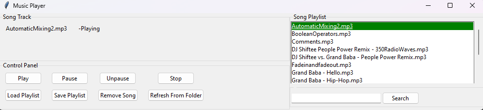

Music player made for learning purposes developed using Tkinter, pygame. The aim of the project was to create an intuitive and responsive music player with features such as playback controls, playlist management, and media handling (including shuffle functionality).

## Features

- **Playback Controls**: The music player includes basic playback controls such as play, pause, stop, and volume adjustment to enhance the user experience.
- **Playlist Management**: Users can easily manage their playlists, including adding, removing, and rearranging songs to create custom playlists.
- **Media Handling**: The application supports various media formats and provides seamless handling of media files, including shuffle functionality to add variety to the listening experience.
- **Responsive Design**: The user interface is designed to be responsive, ensuring that it adapts well to different screen sizes and resolutions for a consistent user experience across devices.

## How to use
- **Install dependencies: [tkinter]| [pygame]**

- **Run** `musicplayer.py`
